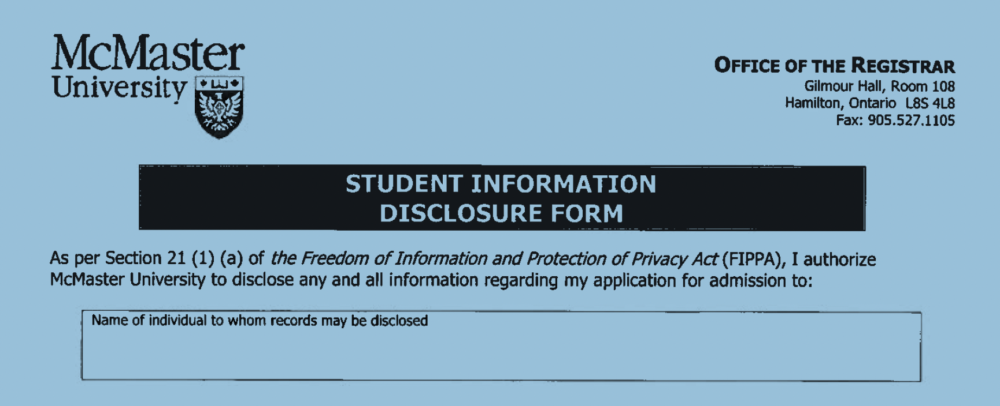
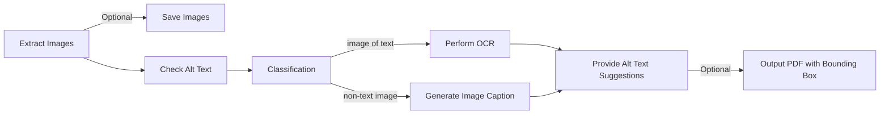
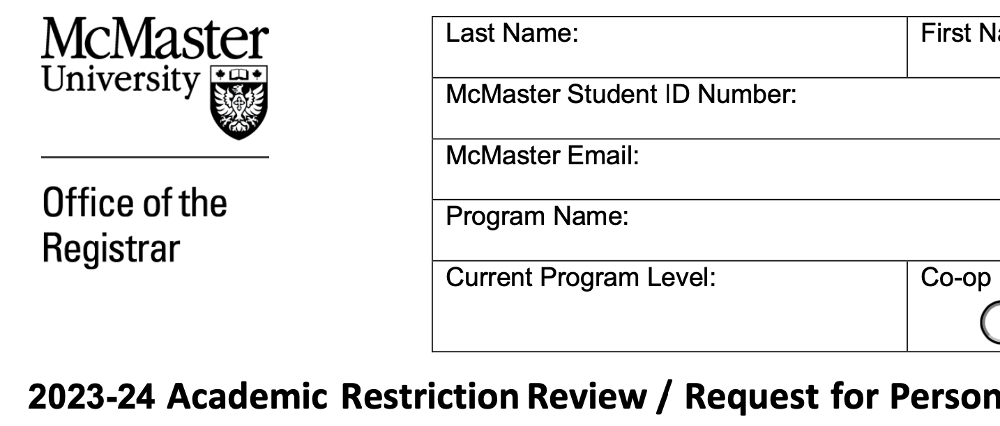
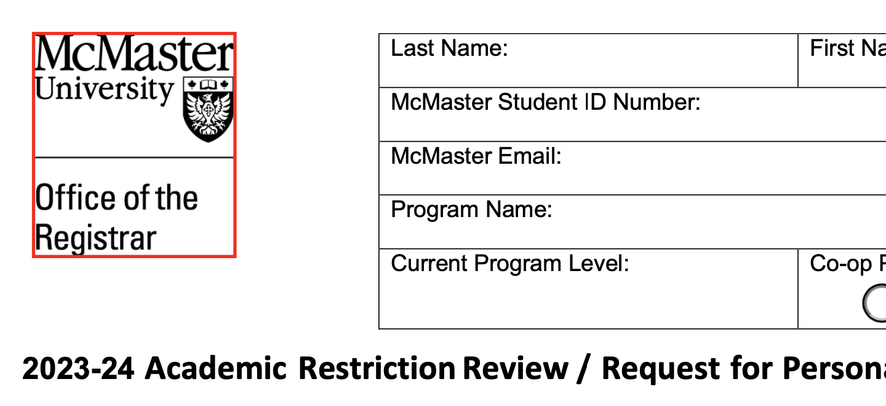
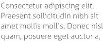
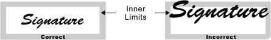
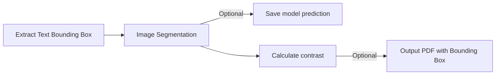
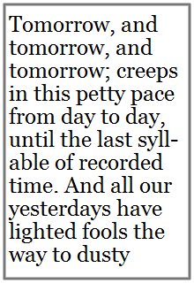
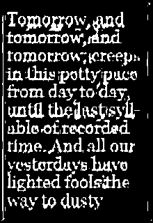
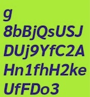

# Offline Document Asseessbility (PDF)


Document accessibility ensures equal access to information for everyone, regardless of their abilities. It not only helps foster a more inclusive society but is also an ethical responsibility to respect diverse audience needs. Besides, investing in document accessibility can benefit businesses by expanding their audience and demonstrating a commitment to ethical practices and social responsibility.

Here is a Python CLI tool designed to detect and address [WCAG](https://www.w3.org/WAI/standards-guidelines/wcag/) accessibility issues identified in offline documents, targeting PDF. It aims to promote a user-friendly experience for everyone and enables users to access documents with [assistive technology](https://www.w3.org/WAI/WCAG22/Understanding/text-spacing.html#dfn-assistive-technology).

## Installation
```
git clone https://github.com/caraaaaa/doc_accessibility.git
conda env create -f env/environment.yml
conda activate doc_accessibility_cli
```

## Features
- [Searchable PDF Creator](#searchable-pdf-creator)
- [Text Alternatives for Non-text Content](#text-alternatives-for-non-text-content)
    - [Identify Non-text Content](#identify-non-text-content)
    - Generate Description for Non-text Content
        - [Classify image-of-text and non-text-image](#image-of-text-classifier)
        - [Image Captioning](#image-captioning)
        - [OCR](#ocr)
- Text Representation
    - [Text Constrast](#text-constrast)
    - [Line Space](#line-spacing)


## Searchable PDF Creator
Convert scanned PDF document to searchable format using **TesseractOCR**.

**Criteria:** User can read or extract the words using assistive technologies, or manipulate the PDF for accessibility. 

**WACG guideline:** [1.4.5](https://www.w3.org/WAI/WCAG22/Understanding/images-of-text)

|     Scanned PDF     |  Searchable PDF   |
| ------------------- | ----------------- |
|  | | 


<details>
  <summary>Usage Instruction</summary>

```PowerShell
python script/scanned2searchable.py [-o OUTPUT_PDF_PATH] [-s] input_pdf_path
```
Default output path: `readable_pdf.pdf` 

```PowerShell
optional arguments:
  -o OUTPUT_PDF_PATH, --output_pdf_path OUTPUT_PDF_PATH
                        The path for the output searchable PDF file.
  -s, --show_result     Show text of the searchable PDF after OCR
```

</details>


## Text Alternatives for Non-text Content
Provide descriptions for images inside *searchable PDF* using **image classification**, **transformer model** and **OCR**.

**Criteria:** All non-text content (e.g. images, formulas) that is presented to the user has a [text alternative](https://www.w3.org/WAI/WCAG22/Understanding/non-text-content#dfn-text-alternative) that serves the equivalent purpose

**WACG guideline:** [1.1](https://www.w3.org/WAI/WCAG22/Understanding/text-alternatives)

**Overview**

<details>
  <summary>Usage Instruction</summary>

```PowerShell
python script/extract_PDF_image.py [--output_img] [--output_folder OUTPUT_FOLDER] [--draw_bbox] [--output_pdf_path OUTPUT_PDF_PATH] [--captioning] input_pdf_path
```
```PowerShell
optional arguments:
  --output_img          Output images extracted from the PDF.
  --output_folder OUTPUT_FOLDER
                        The directory for the output images.
  --draw_bbox           Output PDF with bounding box on images.
  --output_pdf_path OUTPUT_PDF_PATH
                        The path for the output PDF file with bounding box.
  --captioning          Generate caption for images.
```
Default output folder: `pdf_image` 
Default output pdf path: `image_bbox.pdf` 
</details>


## Identify Non-text Content
*Part of [Text Alternatives for Non-text Content](#text-alternatives-for-non-text-content)*

Identify images which without alternative text using **PyMuPDF** and **Pillow**.


|  | | 
| ------------------- | ----------------- |

<details>
  <summary>Usage Instruction</summary>

```PowerShell
python script/extract_PDF_image.py --draw_bbox input_pdf_path
```
Default output path: `image_bbox.pdf` 
</details>

## Image of Text Classifier 
*Part of [Text Alternatives for Non-text Content](#text-alternatives-for-non-text-content)*

Classifiy if an image (such as JPG or PNG) primarily contains text before performing [OCR](#ocr) or [image captioning](#image-captioning). 

|     Image of Text     |  Non-text image   |
| ------------------- | ----------------- |
|  | | 


#### Fine-tuned a image classification model
- **Data:** online-sourced images
- **Model:** ResNet
- **Tools:** fastai
- **Training Script:** [Google Colab](https://colab.research.google.com/drive/18ZZ99ZtyYH6SVsqaDlc3w9VwFjjC7aoE?usp=sharing)


<details>
  <summary>Usage Instruction</summary>

```PowerShell
python script/image_of_text.py [--show_score] input_pdf_path
```
```PowerShell
Optional arguments:
  --show_score    Show the classification score
```
</details>


## Image Captioning
*Part of [Text Alternatives for Non-text Content](#text-alternatives-for-non-text-content)*

Generate descriptive caption for non-text image using Transformer model.

|     Non-text image     |  Caption   |
| ------------------- | ----------------- |
|  | Indication of correct signature| 

#### Fine-tuned a Transformer model
- **Data:**
    - Non-text images extracted from PDF
    - Captioned Manually
    - [Dataset card](https://huggingface.co/datasets/Caraaaaa/non_text_image_captioning) 

- **Model:** 
    - Pre-trained: [GenerativeImage2Text](https://huggingface.co/microsoft/git-base) 
    - Fined-tuned: [model card and inference API](https://huggingface.co/Caraaaaa/text_image_captioning)
- **Tools:** HuggingFace Transformer, PyTorch
- **Training Script:** [Google Colab](https://colab.research.google.com/drive/1QYvXdi0V1AXqlBMR8MpyydNMnK_Vt4dU?usp=sharing)

<details>
  <summary>Usage Instruction</summary>

```
python script/generate_caption.py <input_image_path>
```
</details>

## OCR
*Part of [Text Alternatives for Non-text Content](#text-alternatives-for-non-text-content)*

Extract text from image-of-text using **TesseractOCR**
<details>
  <summary>Usage Instruction</summary>

```
python script/image_of_text.py input_pdf_path
```
</details>

## Text Constrast  
Identify low contrast text inside PDF using **image segmentation** and **contrast ratio analysis**.

**Criteria:** The visual presentation of text and images of text has a contrast ratio of at least 4.5:1

**WACG guideline:** [1.4.3](https://www.w3.org/WAI/WCAG22/Understanding/contrast-minimum.html)


#### Overview


|     Image of Text     |  Predicted Text Segmentation   |     Enought Constrast     |  Low Contrast   |
| ------------------- | ----------------- | ------------------- | ----------------- |
|  | |  | | 

#### Fine-tuned a Transformer model
- **Data:** 
    - Generate synthetic image of text with segmentation mask using Pillow
    - [Dataset Card](https://huggingface.co/datasets/Caraaaaa/synthetic_image_text)
- **Model:**
    - Pre-trained: [SegFormer](https://huggingface.co/nvidia/mit-b0) 
    - Fined-tuned: [model card](https://huggingface.co/Caraaaaa/image_segmentation_text)
- **Tools:** HuggingFace Transformer, PyTorch
- **Training Script:** [Google Colab](https://colab.research.google.com/drive/1_TSeRlUyB8-clkU3-rGBvxiUERcN78XT?usp=sharing)


#### Calculate the [contrast ratio](https://www.w3.org/WAI/WCAG21/Techniques/general/G18.html#procedure)
- <ins>Luminance (brightness) of the colors:</ins>

$$L = 0.2126\times R+0.7152\times G+0.0722\times B$$

$$\small\text{where R, G, and B are normalized to 0-1}$$

- <ins>Contrast Ratio</ins>
$$\frac{L2+0.05}{L1+0.05}$$

$$\small\text{where L1 is the luminance of the lighter color, either text or background}$$


<details>
  <summary>Usage Instruction</summary>

- Generate synthetic image of text
```PowerShell
python script/synthetic_text_seg.py [--sample_no SAMPLE_NO] [--output_folder OUTPUT_FOLDER] [--font_folder FONT_FOLDER]
```
Default output folder: `image_of_text`

Default font input folder: `font` 
- Identify low contrast text
```PowerShell
python script/contrast_pdf.py [--output_bbox_img] [--output_dir OUTPUT_DIR] [--draw_bbox] [--output_pdf_path OUTPUT_PDF_PATH] [--bbox_extractor {PyMyPDF,pdfminer}] input_pdf_path
```
```PowerShell
optional arguments:
  --output_bbox_img     Option to save text block images with low contrast.
  --output_dir OUTPUT_DIR
                        The directory for output images.
  --draw_bbox           Option to draw bounding boxes on low contrast text blocks.
  --output_pdf_path OUTPUT_PDF_PATH
                        The path for the output PDF file with drawn bounding boxes.
  --bbox_extractor {PyMyPDF,pdfminer}
                        Choice of bounding box extractor.
```
Default output folder: `segmentation_model_output`

Default output path with bounding box: `bbox_low_contrast.pdf` 

- Extract text bounding boxes (PDFMiner)
```PowerShell
python script/extract_text_bbox_PDFminer.py [--output_pdf_path OUTPUT_PDF_PATH] input_pdf_path
```
- Extract text bounding boxes (PyMuPDF)
```PowerShell
python script/extract_text_bbox_PyMuPDF.py [--output_pdf_path OUTPUT_PDF_PATH] [--text_img] [--output_dir OUTPUT_DIR] input_pdf_path
```
</details>

## Line Spacing
Analyze the line spacing using **PDFminer**

**Criteria:** Line height (line spacing) to at least 1.5 times the font size


**WACG guideline:** [1.4.12](https://www.w3.org/WAI/WCAG22/Understanding/text-spacing.html)

<details>
  <summary>Usage Instruction</summary>

```
python script/line_spacing.py input_pdf_path
```
</details>

## WCAG Accessibility Issues Covered

- **Images**: non-text image (i.e. icon, header), image of text
- **Text Presentation**: line spacing, text-background contrast
-  <details>
    <summary>Language: language of page, language of parts</summary>

    ## PDF Language Detection
    Examines the PDF's metadata for a specified language property using **Langdetect** and **PyMuPDF**.

    **Criteria:** Assistive technology can determine the language of a page

    **WACG guideline:** [3.1.1](https://www.w3.org/WAI/WCAG22/Understanding/language-of-page.html), [3.1.2](https://www.w3.org/WAI/WCAG22/Understanding/language-of-parts.html)


    Basic usage:
    ```
    python script/language_detection.py input_pdf_path
    ```
    </details>
