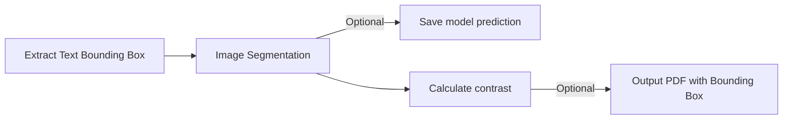

# Offline Document Asseessbility (PDF)

### Target Document
- Scanned PDF
- Searchable PDF
- Potentially some images

### Prerequisites
- Python 3.x
- PyMuPDF (fitz)
- Pytesseract
- pdf2image
- PyPDF2
- pdfminer
- PIL (Python Imaging Library)
- OpenCV (cv2)
- Tesseract OCR (See Tesseract GitHub for installation)

### WCAG Accessibility Issues Covered
- **Images**: non-text image (i.e. icon, header), image of text
- **Text Presentation**: line spacing, text-background contrast
- **Language**: language of page, language of parts

## Searchable PDF Creator
Convert scanned PDF document to searchable PDF file.

Basic usage:
```
python script/scanned2searchable.py <input_pdf_path>
```
With optional output path and text printing:
```
python script/scanned2searchable.py <input_pdf_path> -o <output_pdf_path> --show_result
```
Default output path: `readable_pdf.pdf` 

## Process PDF Images
Process images inside a *searchable PDF*


Basic usage:
```
python script/extract_PDF_image.py <input_pdf_path>
```
With optional output image and PDF with bounding box:
```
python script/extract_PDF_image.py <input_pdf_path> [--output_img] [--output_folder <folder_name>] [--draw_bbox] [--output_pdf_path <output_pdf_name>]
```

## PDF Images - Image of Text Classifier 
A pre-trained model to identify if an image (such as JPG or PNG) primarily contains text
### Prerequisites
- fastai
- A pre-trained model file for image classification `model/imageOfText_classifier.pkl`
### Data Collection and Model Training
- [Google Colab](https://colab.research.google.com/drive/18ZZ99ZtyYH6SVsqaDlc3w9VwFjjC7aoE?usp=sharing)

### Inference
```
python script/image_of_text.py <input_image_path> [--show_score]
```

## PDF Images - Image Captioning
A pre-trained transformer model to analyze the content of an image and produce a descriptive caption. 
### Prerequisites
- Transformers library by Hugging Face
- A pre-trained model `model/finetuned_image_captioning`

### Data Collection
- Non-text images collected from existing PDF with manual captioning: [Caraaaaa/non_text_image_captioning](https://huggingface.co/datasets/Caraaaaa/non_text_image_captioning) 

### Model Training
- [Google Colab](https://colab.research.google.com/drive/1QYvXdi0V1AXqlBMR8MpyydNMnK_Vt4dU?usp=sharing)
### Inference
```
python script/generate_caption.py <input_image_path>
```

## Text Representation - Line Spacing
Analyze the line spacing in a *searchable PDF* and flags any discrepancies that might affect readability

Basic usage:
```
python script/line_spacing.py <input_pdf_path>

```

## Text Representation - Text Constrast  


Identify low contrast text in a *searchable PDF*  using image segmentation and contrast ratio analysis

### Data Collection
Synthetic image of text with segmentation mask [Caraaaaa/synthetic_image_text](https://huggingface.co/datasets/Caraaaaa/synthetic_image_text) 

To generate synthetic image of text:

```
python script/synthetic_text_seg.py --output_folder <output_image_directory> --font_folder <font_directory>
```
##### Prerequisites
- A directory of .ttf font files for text generation `font`

### Model Training - Image Segmentation (Text)
- [Google Colab](https://colab.research.google.com/drive/1_TSeRlUyB8-clkU3-rGBvxiUERcN78XT?usp=sharing)

### Inference

Basic usage:
```
python script/contrast_PDF.py <input_pdf_path>
```
With Option:
```
python script/contrast_PDF.py <input_pdf_path> [--output_bbox_img] [--output_dir <output_directory>] [--draw_bbox] [--output_pdf_path <output_pdf_path>] [--bbox_extractor <PyMyPDF|pdfminer>]

```
##### Extract text bounding boxes (PDFMiner)
```
python script/extract_text_bbox_PDFminer.py <input_pdf_path> [--output_pdf_path <output_pdf_path>]
```
##### Extract text bounding boxes (PyMuPDF)
```
python script/extract_text_bbox_PyMyPDF.py <input_pdf_path> [--output_pdf_path <output_pdf_path>] [--text_img] [--output_dir <output_image_directory>]
```


## PDF Language Detection
- **Metadata Language Check**: Examines the PDF's metadata for a specified language property.
- **Text-Based Language Detection**: Analyzes the text on each page to detect its language.
- **Support for Multi-Language Documents**: Identifies cases where multiple languages are present in the same document.
### Prerequisites
- Langdetect library

Basic usage:
```
python script/language_detection.py <input_pdf_path>
```