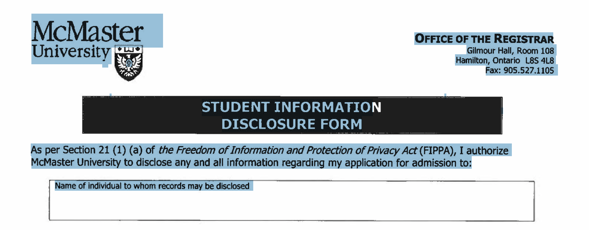

# Offline Document Asseessbility (PDF)


Document accessibility ensures equal access to information for everyone, regardless of their abilities. It not only helps foster a more inclusive society but is also an ethical responsibility to respect diverse audience needs. Besides, investing in document accessibility can benefit businesses by expanding their audience and demonstrating a commitment to ethical practices and social responsibility.

Here is a Python CLI tool designed to detect and address [WCAG](https://www.w3.org/WAI/standards-guidelines/wcag/) accessibility issues identified in offline documents, targeting PDF. It aims to promote a user-friendly experience for everyone and enables users to access documents with [assistive technology](https://www.w3.org/WAI/WCAG22/Understanding/text-spacing.html#dfn-assistive-technology).

## Installation (TODO)
...

## Features
- [Searchable PDF Creator](#searchable-pdf-creator)
- TBC...


## Searchable PDF Creator
Convert scanned PDF document to searchable format using **TesseractOCR**.

**Intent:** To allow user read or extract the words using assistive technologies, or manipulate the PDF for accessibility.

<style>
td, th {
   border: none!important;
}
</style>

|     Scanned PDF     |  Searchable PDF   |
| ------------------- | ----------------- |
|  | | 


<details>
  <summary>Usage Instruction</summary>

```PowerShell
python script/scanned2searchable.py [-h] [-o OUTPUT_PDF_PATH] [-s] input_pdf_path
```
Default output path: `readable_pdf.pdf` 

```PowerShell
optional arguments:
  -o OUTPUT_PDF_PATH, --output_pdf_path OUTPUT_PDF_PATH
                        The path for the output searchable PDF file.
  -s, --show_result     Show text of the searchable PDF after OCR
```

</details>


## Process PDF Images
Process images inside a *searchable PDF*


Basic usage:
```
python script/extract_PDF_image.py <input_pdf_path>
```
With optional output image and PDF with bounding box:
```
python script/extract_PDF_image.py <input_pdf_path> [--output_img] [--output_folder <folder_name>] [--draw_bbox] [--output_pdf_path <output_pdf_name>]
```

### PDF Images - Image of Text Classifier 
A pre-trained model to identify if an image (such as JPG or PNG) primarily contains text
#### Prerequisites
- fastai
- A pre-trained model file for image classification `model/imageOfText_classifier.pkl`
#### Data Collection and Model Training
- [Google Colab](https://colab.research.google.com/drive/18ZZ99ZtyYH6SVsqaDlc3w9VwFjjC7aoE?usp=sharing)

#### Inference
```
python script/image_of_text.py <input_image_path> [--show_score]
```

### PDF Images - Image Captioning
A pre-trained transformer model to analyze the content of an image and produce a descriptive caption. 
#### Prerequisites
- Transformers library by Hugging Face

#### Data Collection
- Non-text images collected from existing PDF with manual captioning: [Caraaaaa/non_text_image_captioning](https://huggingface.co/datasets/Caraaaaa/non_text_image_captioning) 

#### Model Training
- [Google Colab](https://colab.research.google.com/drive/1QYvXdi0V1AXqlBMR8MpyydNMnK_Vt4dU?usp=sharing)
- [Trained Model](https://huggingface.co/Caraaaaa/text_image_captioning)
#### Inference
```
python script/generate_caption.py <input_image_path>
```

### Text Representation - Line Spacing
Analyze the line spacing in a *searchable PDF* and flags any discrepancies that might affect readability

Basic usage:
```
python script/line_spacing.py <input_pdf_path>
```

### Text Representation - Text Constrast  


Identify low contrast text in a *searchable PDF*  using image segmentation and contrast ratio analysis

#### Prerequisites
- Transformers library by Hugging Face
- A directory of .ttf font files for text generation `font`

#### Data Collection
Synthetic image of text with segmentation mask [Caraaaaa/synthetic_image_text](https://huggingface.co/datasets/Caraaaaa/synthetic_image_text) 

To generate synthetic image of text:

```
python script/synthetic_text_seg.py --output_folder <output_image_directory> --font_folder <font_directory>
```

#### Model Training - Image Segmentation (Text)
- [Google Colab](https://colab.research.google.com/drive/1_TSeRlUyB8-clkU3-rGBvxiUERcN78XT?usp=sharing)
- [Trained Model](https://huggingface.co/Caraaaaa/image_segmentation_text)

#### Inference

Basic usage:
```
python script/contrast_PDF.py <input_pdf_path>
```
With Option:
```
python script/contrast_PDF.py <input_pdf_path> [--output_bbox_img] [--output_dir <output_directory>] [--draw_bbox] [--output_pdf_path <output_pdf_path>] [--bbox_extractor <PyMyPDF|pdfminer>]
```
##### Extract text bounding boxes (PDFMiner)
```
python script/extract_text_bbox_PDFminer.py <input_pdf_path> [--output_pdf_path <output_pdf_path>]
```
##### Extract text bounding boxes (PyMuPDF)
```
python script/extract_text_bbox_PyMyPDF.py <input_pdf_path> [--output_pdf_path <output_pdf_path>] [--text_img] [--output_dir <output_image_directory>]
```


### PDF Language Detection
- **Metadata Language Check**: Examines the PDF's metadata for a specified language property.
- **Text-Based Language Detection**: Analyzes the text on each page to detect its language.
- **Support for Multi-Language Documents**: Identifies cases where multiple languages are present in the same document.
#### Prerequisites
- Langdetect library

Basic usage:
```
python script/language_detection.py <input_pdf_path>
```

### WCAG Accessibility Issues Covered

- **Images**: non-text image (i.e. icon, header), image of text
- **Text Presentation**: line spacing, text-background contrast
- **Language**: language of page, language of parts